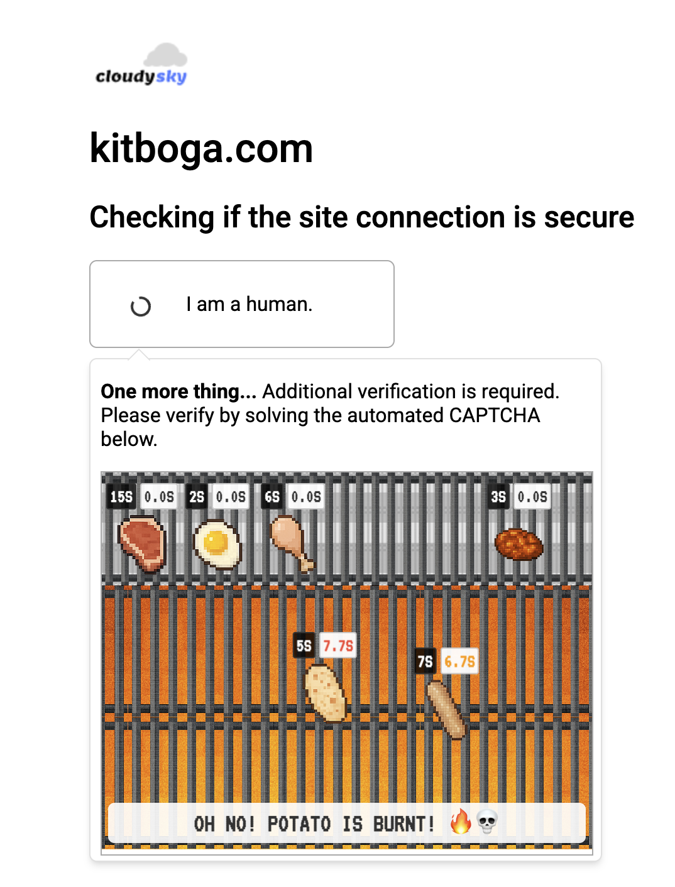

# Wes Bos' Kitboga Code Jam Submission

[\[Try it out here\]](https://wesbos.github.io/Kitboga-captcha)



This captcha has the user cook a number of food items to perfection.

The user must place the items on the grill for the specified amount of time, and remove them within the allowable tolerance.

If a single item is burnt, they must continue to cook the rest of items to completion in order to restart the challenge.

The challenge is complete with fun, yet stressful music and sound effects.

## Settings

The difficulty of the challenge is can be tweaked with the item config.

- **cookTime** - number of seconds to cook the item
- **tolerance** - number of seconds ± to deem the item's cook time acceptable.

```js
const itemConfigs = [
  { name: "Steak", icon: "steak", cookTime: 15, tolerance: 0.2 },
  { name: "Egg", icon: "egg", cookTime: 2, tolerance: 0.3 },
  { name: "Chicken", icon: "chicken", cookTime: 6, tolerance: 1 },
  { name: "Potato", icon: "potato", cookTime: 5, tolerance: 0.8 },
  { name: "Sausage", icon: "sausage", cookTime: 7, tolerance: 1 },
  { name: "Naan", icon: "naan", cookTime: 3, tolerance: 0.5 },
];
```

## Building

The built, unminified, unobfuscated source is available in the `captcha/` folder.

The authored source is in the `captcha-cook/` directory.

You may make changes directly to the `captcha/` directory, or edit the authored source and run `npm install` then `npm run build`.
